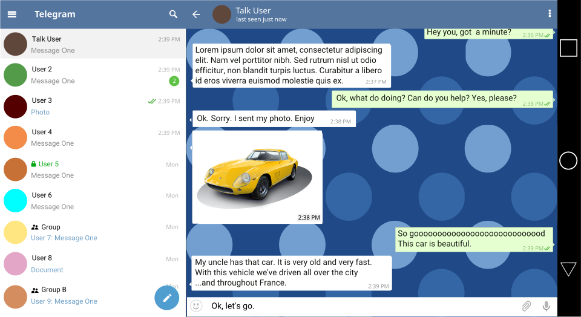
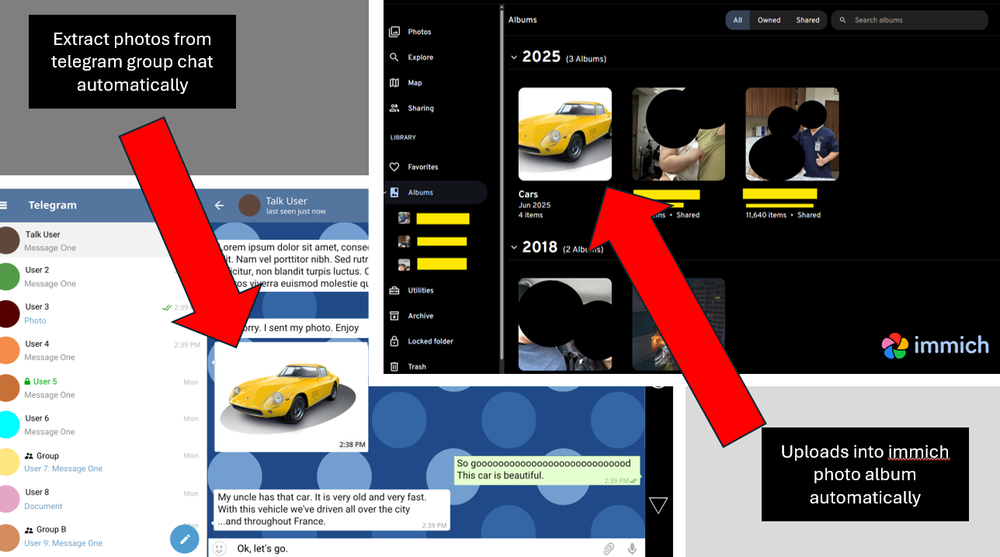
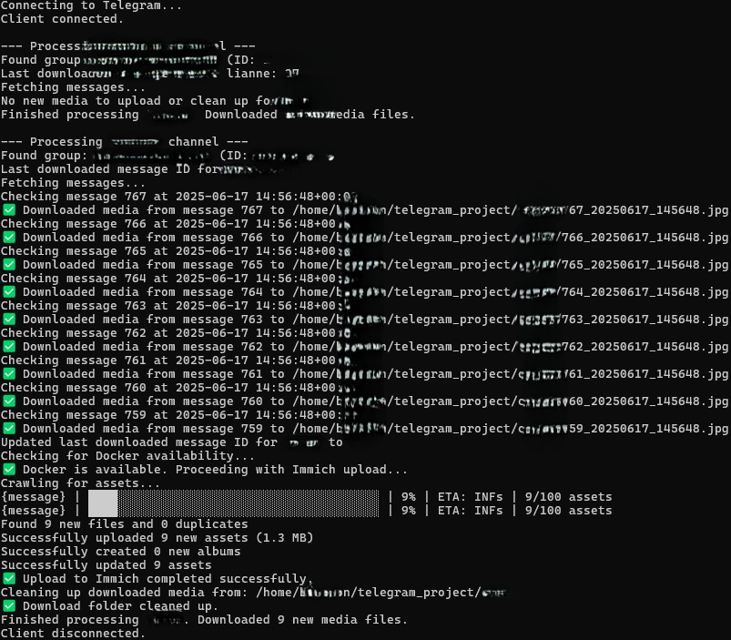

# 🤖 Automating Telegram Media Downloads into Immich with WSL2 and Cron

This guide walks you through automating media downloads from Telegram groups to your Windows machine using WSL2, your existing Python script (`script.py`), and the cron scheduler. Media management via Immich and Docker is also assumed.

---

## 💡 Why This Setup?

I'm reaching the storage limit on Google Photos, and while Immich allows direct uploads, I already use Telegram to share and store photos with my family. Automating this pipeline not only simplifies the upload process, but also ensures redundancy — keeping one copy in Immich and another in Telegram as a form of backup.

---

## 📸 Example Workflow

Here’s how the automation works from Telegram to Immich:

---

<table>
  <tr>
    <td align="center">
      <strong>1. Uploading a Photo in Telegram</strong><br>
      <br>
      <em>A family member shares a photo in a Telegram group.</em>
    </td>
    <td align="center">
      <strong>2. Photo Appears in Immich Automatically</strong><br>
      <br>
      <em>The script uploads the photo to Immich automatically.</em>
    </td>
  </tr>
</table>

---

### 3. CLI Showing Automated Upload

The upload script runs via cron in WSL2 and shows successful uploads:

<p align="center">
  <br>
  <em>CLI output showing the automated cron job running the Telegram-to-Immich upload script.</em>
</p>

---


## 1. Prerequisites

Ensure you have the following before proceeding:

- **Windows 10/11**: WSL2 enabled with your preferred Linux distro (e.g., Ubuntu).

  - To set up WSL2 on windows, i found this helpful video by MikeTheTech 📦 [TroubleChute's WSL2 Setup on Windows](https://www.youtube.com/watch?v=8BTX9mwLcfw&t=12s)

- **Docker Desktop**: Installed with WSL2 integration enabled. Download [Docker Desktop](https://www.docker.com/get-started/) here.

- **Immich**: Installed: Follow the [Immich Quick Start Guide](https://immich.app/docs/overview/quick-start).

  - To set up Immich with Docker, I followed this helpful video tutorial by Thomas Wilde:
📺 [Setting up Immich with Docker (YouTube)](https://www.youtube.com/watch?v=ZJH3ee-fnCc&t=321s&ab_channel=ThomasWilde)

- **Your `script.py` file**: Contains logic for downloading Telegram media and uploading to Immich.
  - Ensure all file paths are configured for Linux:
    - `D:\Brandon\...` → `/mnt/d/Brandon/...` (Windows drive)
    - Or `/home/brandon/your_project_dir/...` (WSL filesystem)
  - Telegram API credentials and Immich API key should be configured correctly.

---

## 2. WSL2 Environment Setup

### A. Project Location & Python Virtual Environment

1. Open your WSL terminal (e.g., Ubuntu).
2. Navigate to your project directory or create it:

```bash
mkdir -p /home/brandon/telegram_project
cd /home/brandon/telegram_project
```

3. Copy your `script.py` into this directory.
4. Create a Python virtual environment:

```bash
python3 -m venv venv
```

5. Activate the virtual environment:

```bash
source venv/bin/activate
```

You should see your prompt change (e.g., `(venv)`).

---

### B. Install Dependencies

With the virtual environment active, install required libraries:

```bash
pip install telethon
pip install python-dotenv
```

---

### C. Test the Script Manually

1. Ensure your virtual environment is active.
2. Run your script:

```bash
python script.py
```

- **First Run**: You'll be prompted for your phone number, Telegram verification code, and possibly 2FA password.
- **Verify Output**: Confirm that media downloads and Immich uploads are successful. Check:
  - Your output folders (e.g., `/home/brandon/telegram_project/lianne/`)
  - `telegram_channel_last_ids.json`

3. (Optional) Deactivate the virtual environment:

```bash
deactivate
```

---

## 3. Automating with Cron (WSL2)

### A. Identify Your Python Interpreter Path

1. Reactivate your virtual environment if needed:

```bash
cd /home/brandon/telegram_project
source venv/bin/activate
```

2. Find the Python path:

```bash
which python
```

Make note of the output path, e.g., `/home/brandon/telegram_project/venv/bin/python`.

3. (Optional) Deactivate the environment:

```bash
deactivate
```

---

### B. Set Up Cron Job

1. Open your WSL terminal.
2. Edit your crontab:

```bash
crontab -e
```

3. Add the cron job:

```bash
0 12,23 * * * cd /home/brandon/telegram_project && /home/brandon/telegram_project/venv/bin/python telegram_downloader.py >> /home/brandon/telegram_project/cron.log 2>&1
```

**Explanation**:

- `0 12,23 * * *`: Runs at 12 PM and 11 PM daily.
- `cd ... && ...`: Ensures correct directory context.
- `>> cron.log 2>&1`: Logs all output and errors to `cron.log`.

4. Save and exit:
   - **Nano**: `Ctrl + X`, then `Y`, then `Enter`
   - **Vim**: `Esc`, then `:wq`, then `Enter`

---

### C. Monitor and Debug

To monitor the log file:

```bash
tail -f /home/brandon/telegram_project/cron.log
```

To test the cron job more frequently during setup:

```bash
* * * * * ...
```

(Change back after confirming it works.)

---

## 4. Ensuring WSL2 is Active with Windows Task Scheduler

To ensure cron jobs run even after reboot:

1. Open **Task Scheduler** from Start menu.
2. Click **Create Basic Task...**.
3. Configure:
   - **Name**: `Activate WSL2 at Startup`
   - **Trigger**: `When the computer starts`
   - **Action**: `Start a program`
   - **Program/script**: `wsl.exe`
   - **Add arguments**: `-l -v`

4. Click **Finish**.

5. Go to **Task Scheduler Library**, find your task:
   - Right-click → **Properties**
   - In **General** tab:
     - Select **Run whether user is logged on or not**
     - Check **Run with highest privileges**
   - Click **OK** and enter your Windows password if prompted.

---

## 5. Start Docker Desktop Automatically

In Docker Desktop:

1. Open **Settings** → **General**
2. Enable: ✅ `Start Docker Desktop when you log in`

If this fails reliably:

- Use Task Scheduler as above
  - Program/script:
    ```
    "C:\Program Files\Docker\Docker\Docker Desktop.exe"
    ```

---

### 6. Start Telegram Automatically

To auto-launch **Telegram Desktop**:

1. Press `Win + R` → type: `shell:startup` → Enter
2. In the **Startup folder**, create a shortcut:
   - Target:
     ```
     C:\Users\<YourUsername>\AppData\Roaming\Telegram Desktop\Telegram.exe
     ```

Now Telegram will auto-open on login.

---

## 📎 How to Get Telegram Group or Channel IDs
To get group/channel IDs:

1. Add [@JsonDumpBot](https://t.me/JsonDumpBot) to the group
2. Send a message in the group
3. The bot replies with a payload like:

```json
"chat": {
  "id": -1001234567890
}
```

Use this `id` in `.env` as `EXAMPLE1_GROUP_ID` or `EXAMPLE2_GROUP_ID`.

---

## 🔐 Environment Configuration

This project uses a `.env` file to manage sensitive configuration like API keys and group IDs.  

An example file named `example.env` is provided in the project root. To get started, rename it to `.env` and update the values accordingly.

```env
# Telegram API credentials
API_ID=your_api_id_here
API_HASH=your_api_hash_here
PHONE_NUMBER=+6512345678

# Telegram group/channel IDs
GROUP_ID_1=-123456789
GROUP_ID_2=-987654321

# Immich API
IMMICH_API_KEY=your_immich_api_key_here
```
💡 Tip: Add .env to your .gitignore to avoid accidentally exposing secrets.

## Finished
With this setup, your Telegram media download and Immich upload script will run automatically at 12 PM and 11 PM every day.

Let me know if you encounter any issues!

## ✅ Summary

| Task                     | Status |
|--------------------------|--------|
| WSL2 environment ready   | ✅     |
| Python script working    | ✅     |
| Cron job scheduled       | ✅     |
| Docker auto-starts       | ✅     |
| Telegram auto-starts     | ✅     |
| Immich integration       | ✅     |
| Secure API keys          | ✅     |

Enjoy your automated Telegram-to-Immich pipeline! 🚀

---

---

## 📚 Resources & Acknowledgements

- [TroubleChute's WSL2 Setup on Windows](https://www.youtube.com/watch?v=8BTX9mwLcfw&t=12s) - A concise walkthrough for enabling WSL2 and installing a Linux distro.

- [Thomas Wilde's Immich Setup Tutorial](https://www.youtube.com/watch?v=ZJH3ee-fnCc&t=321s&ab_channel=ThomasWilde) – A clear and practical guide on installing Immich using Docker.
